# Prusa MK3S+ MUTANT V2 [laser cutter](https://youtu.be/tXEEcxm7fwQ) mod

## Introduction
Check out the video linked in the title. After going through these instructions
that's what you should end up with.

A Prusa MK3S+ printer has been upgraded with the Whambam Mutant V2 system. The
mod was done following mediaman's instructions:
[Prusa MUTANT Upgrade Kit](https://www.thingiverse.com/thing:4948925)

### Additional notes when going for the Z-height extension
Here a few things to consider when following the instructions
- you do not need the two parts
  - `z-axis-top-M_left.stl`
  - `z-axis-top-M_right.stl`
- instead print the `Optional-X-end-idler-M-tall.stl` part
- no need for these parts
  - `MK2.5S_x-endstop-left-M.stl`
  - `fan-shroud.stl`
  - `adapter-printer.stl`
  - `x-endstop-right-M.stl`
  - `extruder-cover.stl`
- as the name suggests, you need two copies of `y-rod-holder-M_x2`
  - for people suffering from the same condition as myself, mirror one part, though not strictly necessary
- when building the x-carriage, add some sort of screw on the righthand side, which allows to adjust the X-endstop. it should bump into the z-carriage assembly at around 255mm from home
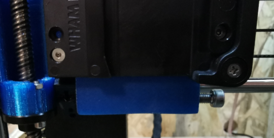
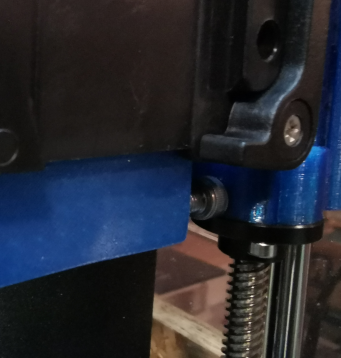

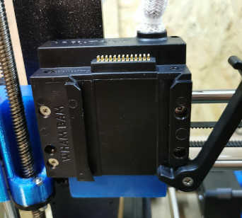

The original Prusa E3D v6 hotend can now easily be re-built using the parts provided by
the mediaman.

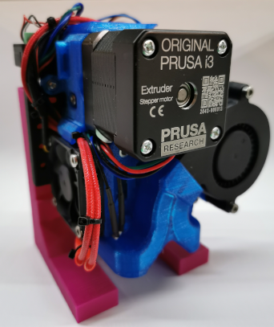
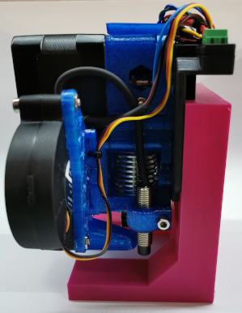
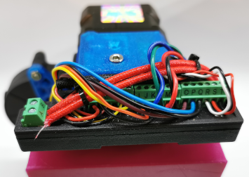

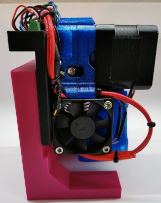
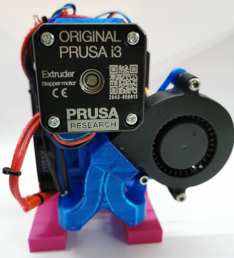

## Wiring diagram fixed plate
The following pinout is used for the fixed plate. It follows closely the reference
pinout provided by Whambam.

| Pin | Signal Name        | uC I/O     | max I |
|-----|--------------------|------------|-------|
| A   | Hotend 24V         | PWR        | 10A   |
| B   | Hotend GND         | open drain | 10A   |
| C   | Thermistor +       | ADC in     | 3A    |
| D   | Thermistor -       | PWR        | 3A    |
| E   | Hotend Fan 5V      | PWR        | 3A    |
| F   | Hotend Fan GND     | open drain | 3A    |
| G   | Hotend Fan TACH    | IN         | 3A    |
| H   | Parts Fan TACH     | IN         | 3A    |
| I   | Parts Fan 5V       | PWR        | 3A    |
| J   | Parts Fan GND      | open drain | 3A    |
| K   | Motor E blue       | DRV out    | 3A    |
| L   | Motor E green      | DRV out    | 3A    |
| M   | Motor E red        | DRV out    | 3A    |
| N   | Motor E black      | DRV out    | 3A    |
| O   | PINDA 5V (brown)   | PWR        | 3A    |
| P   | PINDA GND (blue)   | PWR        | 3A    |
| Q   | PINDA sig (black)  | IN         | 3A    |
| R   | Filament sense sig | IN         | 3A    |
| S   | Filament Sense 5V  | PWR        | 3A    |
| T   | Filament sense GND | PWR        | 3A    |
|     |                    |            |       |

## The Laser

### Disclaimer
Lasers can be extremely dangerous and lead to blindness. Obviously all modifications
are at your own risk and should only be done by well educated people and only
while wearing appropriate eye protection. Note the wavelength and optical power
of your specific laser when purchasing the protective googles.

### Mechanical mounting
Mounting the laser to the mobile plate is as easy as driving a couple of screws
from the back through the mobile plate into the threaded holes of the laser.
It is recommended to use a minimum of two screws, better three or more for a secure
fixation of the laser module.

### Electrical connections
When shopping for the laser module, make sure it is a 24V variant, as this is the
hotend voltage on the Prusa MK3S+ printer. For other printers a 12V laser might
be more suitable. In order to keep the firmware modifications to a minimum, the
hotend temperature is simulated to be constant around 52°C by connecting a 30.1K ohm
resistor to the thermistor terminals. You may also use a spare thermistor which would
measure room temperature. Finally it is also possible to use a potentiometer of 100K
total resistance, which allows to set the temperature to some value of your liking.

Furthermore, the permanent 24V power output is used to feed the laser module. As
the GND return path, any ground wire can be used. To modulate the Laser power
the parts fan PWM output is used. Some electronics is required to make the open-drain
output suitable as a logic level signal for most lasers expecting a PWM signal
between 0 and 5V. You may need to adjust the schematics if your particular laser
module expects some other type of signal (analog, different logic high voltage, ...)

Refer to the following schematic using two pull-up resistors of 470ohm and one
N-channel MOSFET to invert the signal polarity.

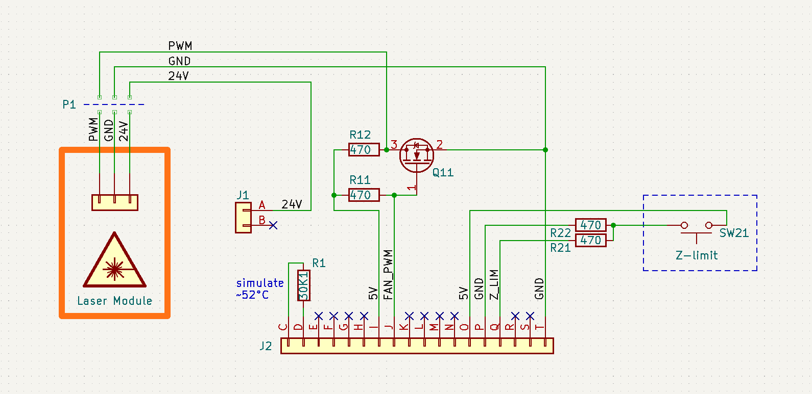

#### wiring of laser
| Pin | Signal Name        |
|-----|--------------------|
| A   | LASER 24V+         |
| B   |                    |
| C   | 30K1 ohm to C      |
| D   | 30K1 ohm from D    |
| E   |                    |
| F   |                    |
| G   |                    |
| H   |                    |
| I   | 5V for pull-up     |
| J   | LASER PWM control  |
| K   |                    |
| L   |                    |
| M   |                    |
| N   |                    |
| O   | 5V for Z-limit SW  |
| P   | GND for Z-limit SW |
| Q   | Z-limit SW         |
| R   |                    |
| S   |                    |
| T   | LASER GND          |
|     |                    |

### additional Z-height limit switch
At this point your laser mod should be ready for use. It is necessary to set the
Z-height manually using the Prusa's user interface before starting a lasercut/engraving
job. Make sure to interrupt the power to the laser while you are homing the head
and adjusting the height. Note that you will have to add a PINDA probe for Z-homing
to work.

A better way than fixing a PINDA probe to the mobile plate and having to adjust
the optimal cutting height before every cut is to add a momentary switch, which
can detect the surface of the work piece at the beginning of every job. Refer to
the following simple schematic on how to use a simple normally open momentary
microswitch to replace the PINDA probe. To fix the switch to the mobile plate,
some 3D printing might be required.

Once the switch is in place, make sure it can touch the surface before any sort
of air-assist nozzle would ram into the build-plate. The switch should also be off
the surface by a couple of millimeters when the optimal focal distance is set.

Follow this procedure to determine the perfect focal length:
 1. home the printer `Calibrate -> Auto home`
 2. manually move the Z-axis up until the perfect distance between the surface and
the laser body is reached. to do this in small steps, it is necessary to connect
Pronterface to the Prusa, as the firmware only allows to move in steps of 1 mm
 3. note the absolute Z-distance either by reading it off of the LCD, or by issuing
the M114 command in Pronterface
 4. adjust the header script with the determined Z-height.

Refer to [this video](https://youtu.be/BLlMHWbL5m0) for a walkthrough on how to
do it using Pronterface.

### Prusa firmware
Finally a small firmware modification is required for the Laser to work properly.
This sounds scarier than it is. A branch with the modifications can be found
[here](https://github.com/pascalgilbert81/Prusa-Firmware-MutantV2/tree/modify/mutant_z_height)
Note that this mod also includes a higher max Z height necessary for the initial
calibration to run successfully. The firmware can be downloaded and compiled according
to the original instructions provided in the README, the mod has only been done for the
*1_75mm_MK3S-EINSy10a-E3Dv6full* variant. An already compiled and tested version
can be downloaded from [here](https://github.com/pascalgilbert81/Prusa-Firmware-MutantV2/releases/tag/MutantV2_Laser). Using this binary is entirely at your own risk, for that reason it is highly
recommended that you compile the firmware yourself.

#### Why a custom firmware?
The firmware will not do a fan check when booting and will not try to determine what type
of fan is used as the parts cooler. This is necessary, as there is no tacho signal
coming from the printer because there is no fan installed. Furthermore the PWM signal controlling
the parts cooling fan is used to set the Laser power.

### Pictures
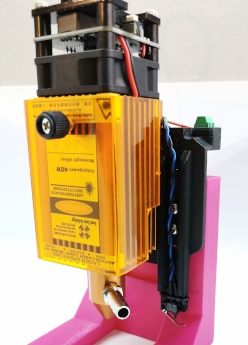
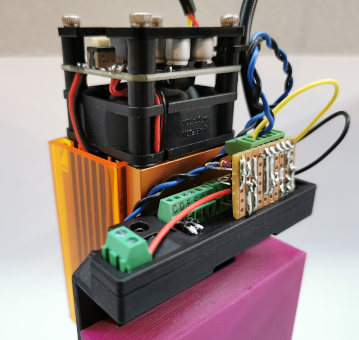
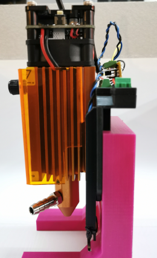

### Generating gcode for the laser
There is a number of ways how to generate gcode for lasercutting/engraving. One simple
and free, yet limited way is to use inkscape with a specialized plugin. It will
convert any paths to gcode instructions. Download and install the
[J-Tech-Photonics-Laser-Tool](https://github.com/JTechPhotonics/J-Tech-Photonics-Laser-Tool)
according to their instructions.

#### customize settings and generate gcode
1. set cutting speed, output directory and filename to suit your project (these settings need to be adjusted according to the job at hand)
2. define the Tool Power Command and Tool Off Command
3. point to the custom g-code header/footer files, download from [here](gcode)
4. hit apply and you'll be presented with your first gcode file, provided that you did draw something on the canvas and convert it to a path (refer to the official J-Tech instructions).

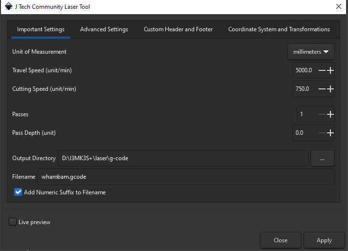

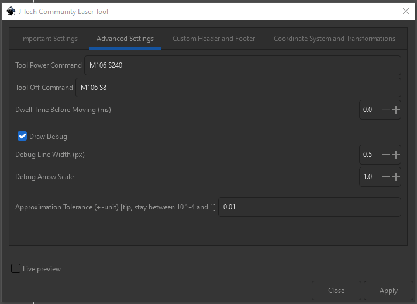

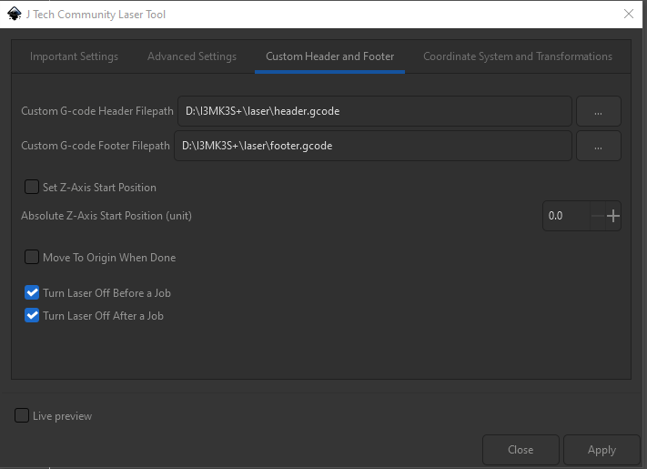

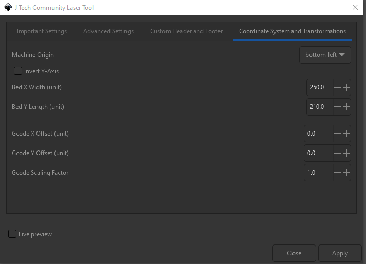

## Conclusion

Enjoy!

Feel free to leave feedback, open issues on this git repo to help me improve these instructions
